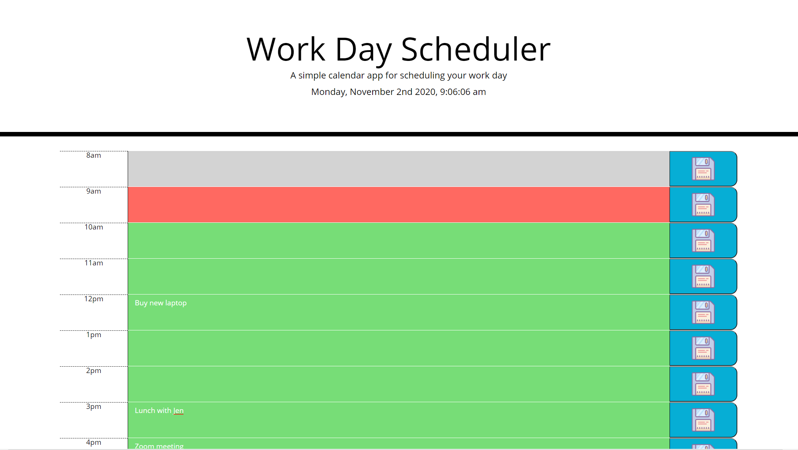

# Day Scheduler

## About the Project
This password generator project is built using **HTML, CSS, and Javascript**. The aim of this project was to create a calendar application that allows a user to save events for each hour of the day by modifying the starter code given. It runs in a browser and has dynamically updated HTML and CSS powered by jQuery. 

### Features
    * Has the current date displayed at the top of the screen
    * The time ows are colour coded to represent whether it's in the past, presnt or future. 
    * The task for the hour can be saved into local storage.
    * When the user revists he task is still saved.

### Screenshots

## URL
The live project can be viewed here: https://mcilhaggis.github.io/day-scheduler/

## Author
Author: Rachael McIlhagga  
Twitter: @mcilhaggis

## License
This source code is available to all and the project is licensed under the MIT License - see the LICENSE.md file for details

## Badges

